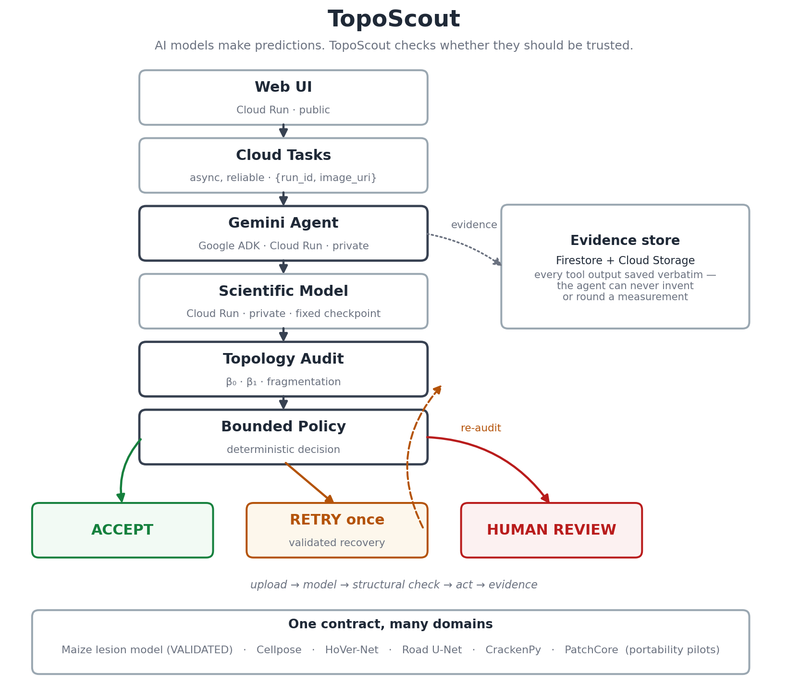

# TopoScout

> **"AI models make predictions. TopoScout checks whether those predictions should be trusted."**

TopoScout is an autonomous quality-control agent for scientific imaging AI,
built for **Google's All Things Agentic Hackathon** (category: Taskmaster).
It runs an approved model, audits the *topology* of the prediction (connected
components, holes, fragmentation), and lets a bounded policy decide: **ACCEPT**,
**RETRY** with one validated recovery, or **HUMAN_REVIEW** with a full evidence
trail. Gemini coordinates the workflow; deterministic tools own every number.

**Live app:** https://toposcout-ui-563759553540.us-central1.run.app
**Cross-domain pilots:** https://toposcout-ui-563759553540.us-central1.run.app/pilots



## Problem

A segmentation model can return a confident-looking mask that is structurally
wrong — one lesion shattered into 65 pieces, a road network split into 26
disconnected fragments. Overlap metrics (Dice/IoU) and per-pixel confidence do
not expose this. Scientists either trust bad masks or review everything by hand.

## What TopoScout does

```
image → approved model → topological audit → bounded policy
                                   │
              ACCEPT ◄─────────────┼──────────────► HUMAN_REVIEW
                                   ▼
                        RETRY (one validated recovery) → re-audit
```

Topology is not a dashboard metric here — **it is the control signal that
changes what the agent does next.**

## Live validated results (maize reference application)

| Leaf | Attempt 1 | Action | Attempt 2 | Final |
|---|---|---|---|---|
| DSC_0059 | β₀ = 65, fragmentation 0.846 | RETRY | β₀ = 20, fragmentation 0.5 | **ACCEPT** |
| DSC_0100 | β₀ = 707, fragmentation 0.887 | RETRY | β₀ = 241, fragmentation 0.668 | **HUMAN_REVIEW** |

Both sequences were executed autonomously by the **deployed Gemini agent**
choosing tools itself — unedited, sanitized traces:
[`artifacts/traces/`](artifacts/traces/).

## Agentic workflow

Gemini 3.5 Flash (Google ADK) observes each tool result and chooses the next
approved action: `inspect_image → run_scientific_segmentation → audit_topology
→ bounded_policy → (retry branch) → create_report`. The LLM can decide only
**when** to call approved tools. It can never choose models, checkpoints,
thresholds, buckets, paths, or executables — those are trusted server-side
configuration, and `bounded_policy` (plain Python) is the sole decision
authority. Every tool output is persisted verbatim in Firestore; reports are
rebuilt from stored evidence, never from the conversation, so the LLM cannot
round, invent, or "improve" a number.

## Architecture (Google technologies)

- **Gemini 3.5 Flash + Google ADK** — agent orchestration (private Cloud Run).
- **Cloud Run** — three services: public UI, private agent, private scientific
  worker (2 CPU / 4 Gi, scale-to-zero, concurrency 1).
- **Cloud Tasks** — reliable async processing: upload returns HTTP 202, a task
  carrying only `{run_id, image_uri}` invokes the OIDC-verified
  `/internal/process` endpoint (no daemon threads, request-based billing safe).
- **Cloud Storage** — canonical run artifacts `runs/<run_id>/{input,attempt1,attempt2,report}`.
- **Firestore** — run state machine + verbatim tool evidence.
- **Secret Manager** — Gemini API key (agent service only; the worker never sees it).

## Cross-domain portability pilots

To test whether the architecture is maize-specific, five independent public
models were wrapped behind the same adapter contract and audited by the same
structural layer — see [`docs/CROSS_DOMAIN_PILOTS.md`](docs/CROSS_DOMAIN_PILOTS.md):

| Domain | Model | Structural finding |
|---|---|---|
| Satellite | MIT road U-Net | road network in **26 disconnected pieces** → suspicious |
| Microscopy | Cellpose 4 | 40 cell instances, plausible |
| Pathology | HoVer-Net (PanNuke) | 8 nuclei, plausible — *not clinical* |
| Materials | CrackenPy | **335 tiny crack fragments** → suspicious |
| Industrial | Anomalib PatchCore | **β₀ = 1** coherent defect region |

Pilots are **portability demonstrations, not validated applications**; every
audit is exactly recomputable from the frozen mask (enforced by tests). Some
third-party imagery is omitted from public redistribution for license reasons —
see [`docs/THIRD_PARTY_ASSETS.md`](docs/THIRD_PARTY_ASSETS.md).

## Try a different domain yourself

The pilots are judge-runnable — the satellite one is turnkey:

```bash
bash scripts/setup_pilot.sh satellite
.pilot-envs/satellite/bin/python scripts/pilot_demo.py run satellite
```

This downloads the MIT road U-Net, runs it on the bundled Massachusetts Roads
tile, and recomputes the frozen reference structure live (26 disconnected
road components, fragmentation 1.0, 46 skeleton endpoints — structurally
suspicious). Materials is equally turnkey; microscopy/pathology/industrial
accept your own appropriately licensed images (`--input`). Full instructions:
[`docs/PILOT_QUICKSTART.md`](docs/PILOT_QUICKSTART.md). New runs write only
to `outputs/pilots/`; the frozen submission evidence never changes. Maize is
the validated reference application; every other domain is a portability pilot.

## Security / guardrails

- Closed request schemas everywhere (`extra="forbid"`): a request cannot name a
  checkpoint, threshold, executable, bucket, or output path.
- Canonical-input enforcement: the agent only reads
  `gs://<trusted-bucket>/runs/<run_id>/input/<file>`; other buckets, other
  runs' prefixes, and nested paths are rejected.
- Private worker/agent (SA-authenticated invocation only); the public UI never
  exposes bucket listings, arbitrary object fetches, or stack traces.
- Bounded retry: at most one recovery attempt, then mandatory escalation.

## Local demo (no cloud, no Gemini)

```bash
python -m venv .venv && source .venv/bin/activate
pip install -e .[dev]
python run_local.py demo_inputs/synthetic_science.png --output-dir demo_outputs
python -m pytest tests/ -q          # hermetic; no network, no Gemini
```

The synthetic demo adapter exercises the full QC → segment → audit → policy →
report workflow, including the RETRY→ACCEPT and RETRY→HUMAN_REVIEW branches
(`demo_inputs/synthetic_fragmented.png`, `synthetic_unrecoverable.png`).

Local UI (deterministic orchestrator + stub-free demo adapter):

```bash
export TOPOSCOUT_SW_ALLOW_LOCAL_IO=1 TOPOSCOUT_TASKS_MODE=local TOPOSCOUT_UI_ORCHESTRATOR=tools
uvicorn webui.app:app --port 8090   # open http://localhost:8090
```

## Cloud deployment (summary)

1. Build the scientific worker: `python scripts/vendor_worker_sources.py`
   (vendors the model sources + checkpoint from the private archive), then
   `docker build -f scientific_worker/Dockerfile ... build/worker_context` and
   deploy privately on Cloud Run (2 CPU / 4 Gi / concurrency 1).
2. Deploy the agent (`Dockerfile`, `TOPOSCOUT_MODE=cloud`, Gemini key via
   Secret Manager) privately; grant it `run.invoker` on the worker.
3. Create the GCS bucket, Firestore `(default)` DB, and a Cloud Tasks queue.
4. Deploy the UI (`webui/Dockerfile`) publicly with its own least-privilege
   service account (`storage.objectAdmin` on the bucket, `datastore.user`,
   `cloudtasks.enqueuer`, `run.invoker` on the agent).

The validated maize checkpoint is private; the public repo runs end-to-end with
the demo adapter, and the hosted app demonstrates the real model.

## Tests

96 passed, 1 skipped in the full private tree; this public tree runs 81
tests (the same suites minus the private-model integration test). All tests are hermetic — no
Gemini calls, no cloud access, stubbed inference.

## Pre-existing work vs built during the hackathon

See [`PREEXISTING_COMPONENTS.md`](PREEXISTING_COMPONENTS.md).
**Pre-existing:** the maize lesion model, its training research, and the
underlying topology research.
**Built during the hackathon:** the TopoScout agent, ADK orchestration, bounded
autonomous workflow, all three Cloud Run services, Cloud Tasks pipeline,
Firestore/GCS evidence architecture, web UI, adapter contract, and the
cross-domain portability framework.

## Limitations

- The maize application is validated; the five pilots are portability
  demonstrations only (no clinical/GIS/safety/manufacturing claims).
- Cold starts pay ~2 minutes on the first request after idle.
- One retry strategy per domain today; retries are validated only for maize.
- Noncommercial third-party assets (MVTec AD, PanNuke weights, Cellpose
  training data) are used only in private evaluation with attribution.
